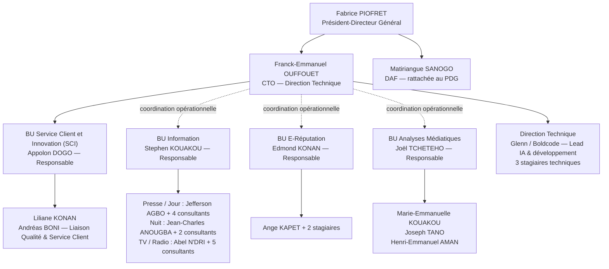

# CONTEXTE VDM — VERSION COMPACTE POUR IA

## Référence

Entreprise : **Veilleur des Médias (VDM)**  
Document source : **Organigramme VDM 2026 — v1.1 — 12 juin 2026**

## Schéma organisationnel

### Légende

- `-->` : lien hiérarchique direct.
- `-.->` : coordination opérationnelle du CTO, sans autorité hiérarchique directe.

## Gouvernance

- **CODIR** : PDG + CTO + DAF.
- **COMEX** : CODIR + responsables des quatre Business Units.
- La **DAF** dépend directement du PDG et reste hors du périmètre du CTO.
- La **BU SCI** dépend hiérarchiquement du CTO.
- Pour les BU Information, E-Réputation et Analyses Médiatiques, le CTO agit comme référent opérationnel transversal.
- L’autorité hiérarchique de chaque BU appartient à son Responsable.
- En cas de doute : consultation du CTO ; dernier recours : PDG.

## Business Units

### BU Service Client et Innovation

- Responsable : **Appolon DOGO**
- Équipe :
  - Liliane KONAN
  - Andréas BONI — Liaison Qualité & Service Client
- Rattachement hiérarchique direct au CTO.

### BU Information

- Responsable : **Stephen KOUAKOU**
- Pôle Presse / Jour : Jefferson AGBO + 4 consultants
- Pôle Nuit : Jean-Charles ANOUGBA + 2 consultants
- Pôle TV / Radio : Abel N'DRI + 5 consultants

### BU E-Réputation

- Responsable : **Edmond KONAN**
- Équipe : Ange KAPET + 2 stagiaires

### BU Analyses Médiatiques

- Responsable : **Joël TCHETEHO**
- Équipe :
  - Marie-Emmanuelle KOUAKOU
  - Joseph TANO
  - Henri-Emmanuel AMAN
- Promotion prévue comme Directeur de BU en septembre 2026.

## Direction Technique

- CTO : **Franck-Emmanuel OUFFOUET**
- Glenn / Boldcode : Lead IA & développement, prestataire externe
- 3 stagiaires techniques

## Règles métier et de reporting

- Chaque BU transmet un reporting hebdomadaire au CTO.
- Le CTO transmet un rapport mensuel consolidé au PDG.
- La BU SCI effectue une revue obligatoire des livrables mensuels et trimestriels.
- L’avis de la BU SCI est consultatif et non bloquant.
- La décision finale appartient au Responsable de la BU productrice.
- E-Réputation : collecte des données brutes et veille.
- Analyses Médiatiques : interprétation qualitative.
- Les litiges de périmètre sont arbitrés par le CTO.

## Consignes pour l’IA

- Respecter strictement les rôles, équipes et rattachements ci-dessus.
- Ne pas inventer de poste, d’équipe, de pouvoir de validation ou de relation hiérarchique.
- Distinguer :
  - autorité hiérarchique ;
  - coordination opérationnelle ;
  - avis consultatif.
- Utiliser ce fichier comme source de vérité pour les rôles, permissions, validations, reportings et tableaux de bord.
- En cas d’information absente, demander une précision au lieu de supposer.
- Pour économiser les tokens :
  - ouvrir uniquement les fichiers nécessaires ;
  - ne pas réécrire les fichiers inchangés ;
  - fournir uniquement le code utile ;
  - limiter les explications aux décisions importantes.
